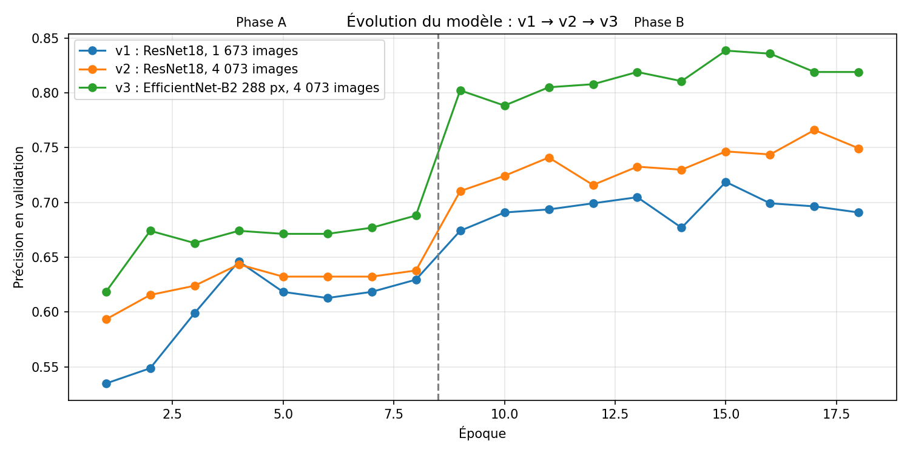
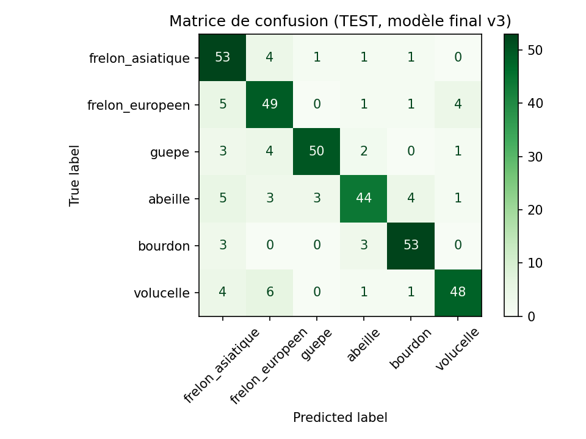

# 🐝 Frelon asiatique ou pas ?

**Classification d'insectes par fine-tuning d'un réseau de neurones convolutif (PyTorch)**

👉 **Application en ligne : https://frelon-detector.streamlit.app**

Projet du cours *Advanced Practical Machine Learning* (Pr. Souheil Hanoune), aivancity School of AI & Data.
Équipe : Rahma Lassoued

---

## Le problème

Le frelon asiatique (*Vespa velutina*) est une espèce invasive qui décime les ruches en France. Il est souvent confondu avec le frelon européen (*Vespa crabro*), une espèce indigène utile, avec les guêpes, ou même avec la volucelle zonée, une mouche inoffensive qui imite le frelon. Une mauvaise identification conduit soit à détruire inutilement un nid d'espèce utile, soit à ne pas signaler un nid dangereux.

Ce projet entraîne un modèle de deep learning qui identifie, à partir d'une photo, l'une de 6 espèces :

| Classe | Espèce |
|---|---|
| frelon_asiatique | *Vespa velutina* (invasive) |
| frelon_europeen | *Vespa crabro* |
| guepe | *Vespula sp.* |
| abeille | *Apis mellifera* |
| bourdon | *Bombus terrestris* |
| volucelle | *Volucella zonaria* (mouche qui imite le frelon) |

## Les données

- **Source** : API publique d'[iNaturalist](https://www.inaturalist.org), plateforme de sciences participatives.
- **Filtres** : observations faites en France, de qualité « research grade » (identification validée par la communauté), une seule photo par observation, photos sous licence Creative Commons uniquement.
- **Nettoyage** : suppression des images en double (empreinte MD5) et des images de moins de 224 px.
- **Volume final** : 4 791 images, classes équilibrées.

| Ensemble | Images | Rôle |
|---|---|---|
| Entraînement | 4 073 | Apprentissage du modèle |
| Validation | 359 | Choix du meilleur modèle et des améliorations |
| Test | 359 | Évaluation finale, utilisée une seule fois |

Le découpage est stratifié : chaque ensemble contient la même proportion de chaque espèce.

## La démarche : trois versions guidées par le diagnostic

| Version | Modèle | Données d'entraînement | Précision (validation) | Diagnostic |
|---|---|---|---|---|
| v1 | ResNet18, 224 px | 1 673 images | 71,9 % | Surapprentissage ; biais « insecte peu visible → frelon asiatique » |
| v2 | ResNet18, 224 px | 4 073 images | 76,6 % | Surapprentissage réduit, mais l'extraction de caractéristiques plafonne à 64 % |
| **v3** | **EfficientNet-B2, 288 px** | **4 073 images** | **83,8 %** | **Modèle final** |

Chaque version est entraînée en deux phases de fine-tuning :

1. **Phase A** : le réseau pré-entraîné (ImageNet) est gelé ; seule notre tête de classification (couche cachée de 256 neurones, ReLU, Dropout 0,3, puis 6 sorties) est entraînée.
2. **Phase B** : les derniers blocs du réseau sont dégelés et ré-entraînés avec un learning rate 10 fois plus petit, pour adapter le réseau aux détails de nos espèces sans effacer ce qu'il a appris.

Réglages : CrossEntropyLoss, optimiseur Adam (1e-3 pour la tête, 1e-4 pour les blocs dégelés), batchs de 32 images, augmentation de données (recadrage modéré, retournement, rotation, luminosité et contraste, sans modifier les couleurs, qui sont un indice essentiel).



## Résultats sur le jeu de test (modèle v3)

**Précision globale : 82,7 %** (validation : 83,8 %), ce qui indique une bonne généralisation.

| Espèce | Précision | Rappel | F1-score |
|---|---|---|---|
| Bourdon | 0,883 | 0,898 | 0,891 |
| Guêpe | 0,926 | 0,833 | 0,877 |
| Volucelle | 0,889 | 0,800 | 0,842 |
| Frelon asiatique | 0,726 | 0,883 | 0,797 |
| Abeille | 0,846 | 0,733 | 0,786 |
| Frelon européen | 0,742 | 0,817 | 0,778 |



**Principaux enseignements :**
- La confusion la plus fréquente concerne les deux espèces de frelons.
- La volucelle est parfois prise pour un frelon européen : son mimétisme trompe aussi le modèle.
- Le modèle trouve 88 % des frelons asiatiques, mais environ 1 alerte « frelon asiatique » sur 4 est fausse. L'application présente donc ses résultats comme une suspicion à faire confirmer, et signale quand le modèle hésite (confiance inférieure à 60 %).

## Limites

- Le modèle ne connaît que 6 espèces : tout autre insecte sera classé dans l'une d'elles.
- Les erreurs concernent surtout les photos où l'insecte est petit, flou, caché ou mort.
- Les données citoyennes contiennent un peu de bruit (photos ambiguës, plusieurs insectes).
- En v3, le réseau et la résolution ont été changés en même temps : leurs effets respectifs ne sont pas séparés.

## Contenu du dépôt

| Fichier | Rôle |
|---|---|
| `entrainement_frelon.ipynb` | Notebook complet : collecte, EDA, préparation, entraînements v1 à v3, évaluation |
| `app.py` | Application Streamlit |
| `modele_frelon.pt` | Poids du modèle final v3, enregistrés en demi-précision (16 Mo, précision identique) |
| `config.json` | Classes, taille d'image et normalisation utilisées par l'application |
| `exemples/` | 6 photos du jeu de test pour essayer l'application, avec leurs crédits |
| `figures/` | Graphiques de l'analyse |
| `requirements.txt` | Bibliothèques nécessaires |

## Lancer l'application en local

```bash
pip install -r requirements.txt
streamlit run app.py
```

## Crédits

Photos : contributeurs d'[iNaturalist](https://www.inaturalist.org), sous licences Creative Commons. Les auteurs et licences des photos d'exemple sont listés dans `exemples/credits.csv`. Modèle pré-entraîné : EfficientNet-B2 (torchvision, poids ImageNet).
